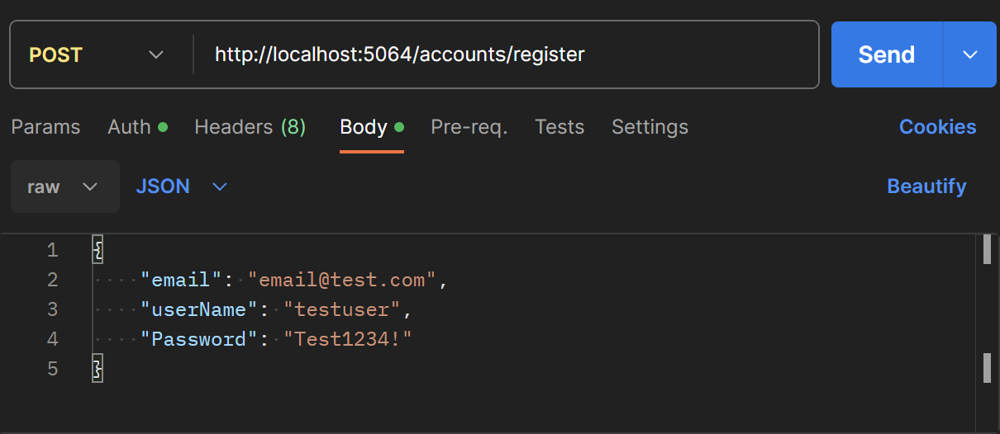
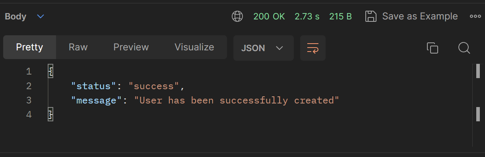
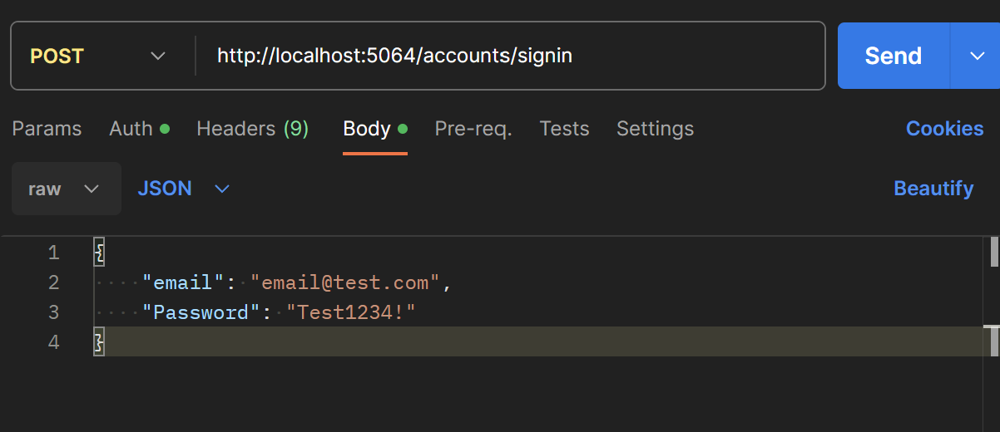
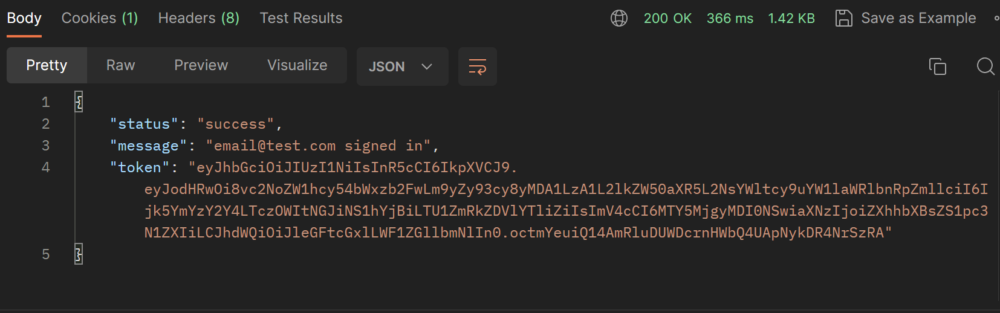
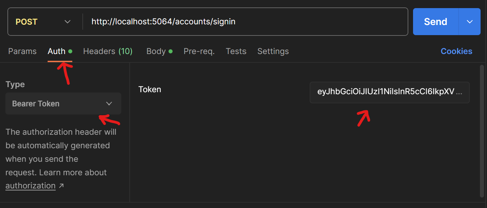
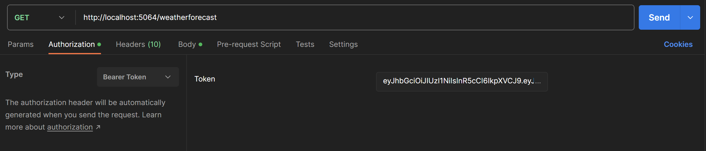
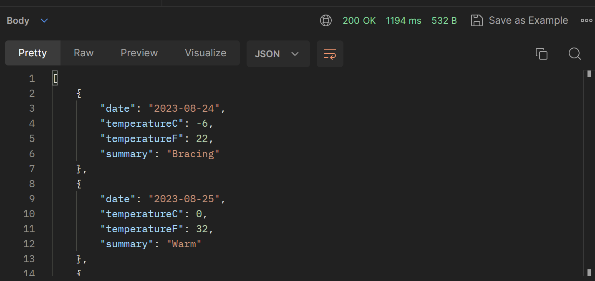
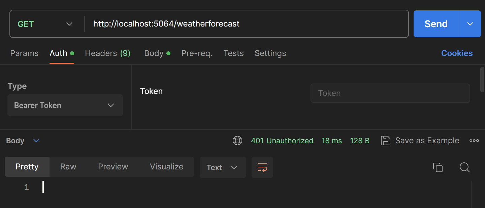
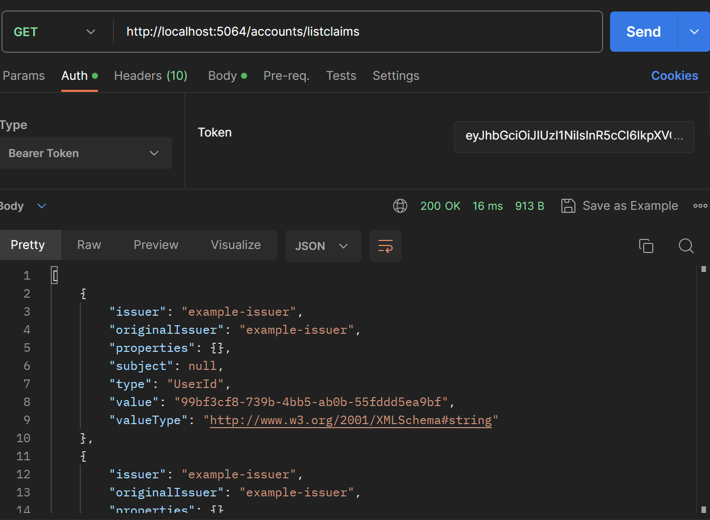

# Adding Authorization to an API with Identity and JWT

## This repo aims to walk you through setting up a basic ASP.NET web API with authorization using Identity and JWT tokens.

_This app is being built with .NET 7_

### Initial project setup:

To first setup the project, we will scaffold a basic Web API using the `dotnet new` command.
Run the following command:

`dotnet new webapi -o AuthorizationDemo`

_AuthorizationDemo here is used as the project name, feel free to name this anything you'd like._

Now that we have a solid foundation, we will need to add a few packages. CD into your project folder, and run these commands:

```
dotnet add package Pomelo.EntityFrameworkCore.MySql --version 7.0.0
dotnet add package Microsoft.EntityFrameworkCore.Design --version 7.0.0
dotnet add package Microsoft.AspNetCore.Identity.EntityFrameworkCore --version 7.0.0
dotnet add package Microsoft.AspNetCore.Authentication.JwtBearer --version 7.0.0
```

_Note: if you are using .NET 6, change the number in the `--version` flag of all packages to be `6.0.0` instead of `7.0.0`_

This will install EFCore, to allow us to work with a MySQL database, EFCore Design, which will let us quickly setup our database with migrations, Identity, which will handle a lot of the user management for us, and JwtBearer, which is how we will create tokens and authorize our users.

### Setting up Entity and Identity

In the root of your project, there should be an `appsettings.json` file. If there is not, go a head and create one. There are a few things we will need to add to this. The first is a connection string, which is how our app will connect to our database. In the `appsettings.json`, let's add these lines:

```json
"ConnectionStrings": { "DefaultConnection": "Server=localhost;Port=3306;database={database-name};uid=root;pwd={password};" },
```

_Be sure to replace {database-name} and {password} with a database name of your choice and your MySQL password_

We are also going to want to add some JWT configuration, which will make sure that the keys that we are creating are unique. Underneath the connection strings, let's add these lines:

```json
"JWT": {
    "ValidAudience": "example-audience",
    "ValidIssuer": "example-issuer",
    "Secret": "SecretPassword12"
  }
```

Let's quickly breakdown what this object is. The `ValidAudience` key of our object is indicating who we are intending to distribute our JWT Tokens to, the `ValidIssuer` indicates who are the ones creating the tokens, and the `Secret` is a special string that will be used to encode our JWTs, to make them unique to our application. Depending on what type of algorithm being used, the `Secret` string will need to be a certain length. In this case, it needs to be at least 16 characters long.

Next lets create a model for our database, and a model for our application user. In the root of the project, create a folder named `Models`. In that `Models` folder, let's create a filed called `AuthorizationDemoDbContext`, and a file called `ApplicationUser.cs`. These models will help us configure Entity and Identity. First, lets setup the `ApplicationUser` model. In `ApplicationUser.cs`, let's add this code:

```c#
using Microsoft.AspNetCore.Identity;

namespace AuthorizationDemo.Models
{
    public class ApplicationUser : IdentityUser
    {

    }
}
```

The `ApplicationUser` is the model that will be storing all our user information. We want this model to have all the Identity functionality, so we are inheriting from `IdentityUser`. Creating a new class that inherits from `IdentityUser` gives us the flexibility to add more properties if we needed to. For example, if we wanted all users to have a `FirstName`, we could adjust our class to look like this:

```c#
public class ApplicationUser : IdentityUser
{
    public string FirstName {get;set;}
}

```

It's up to you what you want your `ApplicationUser` to have. In my case, I am going to leave it blank.

_Note: The `IdentityUser` class already contains some properties, like `UserName` and `Email`. [Here is some documentation that covers more details about the `IdentityUser` class](https://learn.microsoft.com/en-us/dotnet/api/microsoft.aspnetcore.identity.entityframeworkcore.identityuser?view=aspnetcore-1.1)_

Next let's add this code to the `AuthorizationDemoDbContext.cs` file:

```c#
using Microsoft.AspNetCore.Identity.EntityFrameworkCore;
using Microsoft.EntityFrameworkCore;

namespace AuthorizationDemo.Models
{
    public class AuthorizationDemoDbContext : IdentityDbContext<ApplicationUser>
    {
        public AuthorizationDemoDbContext(DbContextOptions options) : base(options) { }

    }

}
```

This class, `AuthorizationDemoDbContext` is inheriting from the `IdentityDbContext` class. We are invoking the base constructor here, to make sure that everything is created successfully. This will setup Identity in our database, and create a table for us called `Users`, that will be modeled after the `ApplicationUser` class. This file is also where we can setup other tables in our database, but for the purpose of this project, we are going to leave this file as is.

### Configuring the Program.cs file

Next we need to add some configurations to our `Program.cs` file. First, since we will not be using Swagger for this project, I am going to remove these lines:

`builder.Services.AddSwaggerGen();`

and

```c#
if (app.Environment.IsDevelopment())
{
    app.UseSwagger();
    app.UseSwaggerUI();
}
```

Next we will setup our EFCore DB Context. Let's add this code:

```c#
builder.Services.AddDbContext<AuthorizationDemoDbContext>(
                        dbContextOptions => dbContextOptions
                          .UseMySql(
                            builder.Configuration["ConnectionStrings:DefaultConnection"], ServerVersion.AutoDetect(builder.Configuration["ConnectionStrings:DefaultConnection"]
                          )
                        )
                      );

```

This will allow our app to connect to a MySQL database, using the connection strings specified in our `appsettings.json` file, and it will be modeled after the `AuthorizationDemoDbContext` model.

Now lets add Identity configuration. Underneath the DbContext configuration, add this code:

```c#
builder.Services.AddIdentity<ApplicationUser, IdentityRole>()
    .AddEntityFrameworkStores<AuthorizationDemoDbContext>()
    .AddDefaultTokenProviders();
```

This will configure Identity to use our specific `ApplicationUser` class, as well as our `AuthorizationDemoDbContext`.

After the Identity configuration, we can configure our app to use Authorization with JWT. Let's add this code below the Identity config:

```c#
builder.Services.AddAuthentication(options =>
{
    options.DefaultAuthenticateScheme = JwtBearerDefaults.AuthenticationScheme;
    options.DefaultChallengeScheme = JwtBearerDefaults.AuthenticationScheme;
    options.DefaultScheme = JwtBearerDefaults.AuthenticationScheme;
})
.AddJwtBearer(options =>
{
    options.SaveToken = true;
    options.RequireHttpsMetadata = false;
    options.TokenValidationParameters = new TokenValidationParameters()
    {
        ValidateIssuer = true,
        ValidateAudience = true,
        ValidAudience = builder.Configuration["JWT:ValidAudience"],
        ValidIssuer = builder.Configuration["JWT:ValidIssuer"],
        IssuerSigningKey = new SymmetricSecurityKey(Encoding.UTF8.GetBytes(builder.Configuration["JWT:Secret"]))
    };
});

```

There is a lot going on here, so let's quickly break this down: The first method we are calling, `builder.Services.AddAuthentication` is setting up our app to use authentication, and the options being passed into it are saying that we will be using the `JwtBearerDefaults.AuthenticationScheme` for most of our authentication.
The next method, `.AddJwtBearer` is where we are configuring our JWT token. The key part of this is the `options.TokenValidationParameters` property. This is where we define what constitutes a valid token, so lets break this down.

```c#
ValidateIssuer = true,
ValidateAudience = true,
```

These first two lines are simply indicating that our token needs to have a valid issuer and valid audience in order to be verified, and the next two lines are where we are setting what the valid issuer and valid audience are. These lines:

```c#
ValidAudience = builder.Configuration["JWT:ValidAudience"],
ValidIssuer = builder.Configuration["JWT:ValidIssuer"],
```

are grabbing the values from the `JWT` object in the `appsettings.json` file, and using them for a our token validation. And the same thing is happening on the next line here:

```c#
 IssuerSigningKey = new SymmetricSecurityKey(Encoding.UTF8.GetBytes(builder.Configuration["JWT:Secret"]))
```

The key that will be used to sign the tokens is being created here, with the value we set for the `Secret` key of the `JWT` object in the `appsettngs.json` file.

There is one more key line that we need to add to the bottom of our `Program.cs` file.

**Above** this line:

```
app.UseAuthorization();
```

we will want to add this line:

```
app.UseAuthentication();
```

Now our `Program.cs` file should be all configured, and we should be ready to start building functionality. Here is what the complete file should look like:

```c#
using System.Text;
using AuthorizationDemo.Models;
using Microsoft.AspNetCore.Authentication.JwtBearer;
using Microsoft.AspNetCore.Identity;
using Microsoft.EntityFrameworkCore;
using Microsoft.IdentityModel.Tokens;

var builder = WebApplication.CreateBuilder(args);

builder.Services.AddDbContext<AuthorizationDemoDbContext>(
                        dbContextOptions => dbContextOptions
                          .UseMySql(
                            builder.Configuration["ConnectionStrings:DefaultConnection"], ServerVersion.AutoDetect(builder.Configuration["ConnectionStrings:DefaultConnection"]
                          )
                        )
                      );
builder.Services.AddIdentity<ApplicationUser, IdentityRole>()
    .AddEntityFrameworkStores<AuthorizationDemoDbContext>()
    .AddDefaultTokenProviders();

builder.Services.AddAuthentication(options =>
{
    options.DefaultAuthenticateScheme = JwtBearerDefaults.AuthenticationScheme;
    options.DefaultChallengeScheme = JwtBearerDefaults.AuthenticationScheme;
    options.DefaultScheme = JwtBearerDefaults.AuthenticationScheme;
})
.AddJwtBearer(options =>
{
    options.SaveToken = true;
    options.RequireHttpsMetadata = false;
    options.TokenValidationParameters = new TokenValidationParameters()
    {
        ValidateIssuer = true,
        ValidateAudience = true,
        ValidAudience = builder.Configuration["JWT:ValidAudience"],
        ValidIssuer = builder.Configuration["JWT:ValidIssuer"],
        IssuerSigningKey = new SymmetricSecurityKey(Encoding.UTF8.GetBytes(builder.Configuration["JWT:Secret"]))
    };
});

builder.Services.AddControllers();

builder.Services.AddEndpointsApiExplorer();


var app = builder.Build();


app.UseHttpsRedirection();

app.UseAuthentication();
app.UseAuthorization();

app.MapControllers();

app.Run();

```

### Adding User registration functionality

Let's start by creating a new controller in the `Controllers` folder. First, create a file called `AccountsController.cs`, and add this code:

```c#
using Microsoft.AspNetCore.Identity;
using Microsoft.AspNetCore.Mvc;
using AuthorizationDemo.Models;

namespace AuthorizationDemo.Controllers;

[ApiController]
[Route("[controller]")]
public class AccountsController : ControllerBase
{

    private readonly UserManager<ApplicationUser> _userManager;
    private readonly SignInManager<ApplicationUser> _signInManager;
    private readonly IConfiguration _configuration;

    public AccountsController(UserManager<ApplicationUser> userManager, SignInManager<ApplicationUser> signInManager, IConfiguration configuration)
    {
        _userManager = userManager; ;
        _signInManager = signInManager;
        _configuration = configuration;
    }


}
```

This code for our controller will give us a good starting point for being able to manage accounts. The `_userManager` private field will allow us to create users, and the `_signInManager` will allow us to log a user in. We also have a `_configuration` field, which will let us access the `JWT` object in our `appsettings.json`, so we can create valid tokens. We are using dependency injection in our constructor, which is what will allow us to access values from those fields later.

Let's now work on registering and signing in. First, we are going to create a few data transfer objects to make this process a bit easier for us. In the models folder let's create two files named `RegisterDto.cs` and `SignInDto.cs`.
Here is the code for the `RegisterDto`:

```c#
namespace AuthorizationDemo.Models;

public class RegisterDto
{
    public string Email { get; set; }
    public string UserName { get; set; }
    public string Password { get; set; }
}

```

and here is the code for the `SignInDto`:

```c#
namespace AuthorizationDemo.Models;

public class SignInDto
{
    public string Email { get; set; }
    public string Password { get; set; }
}
```

Both here are pretty simple classes that will help us organize our data we get from a user request.

Now, let's create a `Register` action. Heading back over to the `AccountsController.cs` file, we will add this code below our constructor:

```c#
[HttpPost("register")]
    public async Task<IActionResult> Register([FromBody] RegisterDto user)
    {
        var userExists = await _userManager.FindByEmailAsync(user.Email);
        if (userExists != null)
        {
            return BadRequest(new { status = "error", message = "Email already exists" });
        }

        var newUser = new ApplicationUser() { Email = user.Email, UserName = user.UserName };
        var result = await _userManager.CreateAsync(newUser, user.Password);
        if (result.Succeeded)
        {
            return Ok(new { status = "success", message = "User has been successfully created" });
        }
        else
        {
            return BadRequest(result.Errors);
        }
    }

```

This code here will take a user object from the body of the request, and go through the process of creating a new user. Let's break this code down into chunks:

```C#
var userExists = await _userManager.FindByEmailAsync(user.Email);
if (userExists != null)
{
     return BadRequest(new { status = "error", message = "Email already exists" });
}
```

First, we want to check if a user with the same email has already been created. We search for all users by using the `FindByEmailAsync` function, and store that in the `userExists` variable. Then we have a simple if statement. If the user does exist, then we don't want to create one, so we return a `BadRequest`, with an an anonymous type object that has a status and message property.

Here is the next block of code:

```c#
var newUser = new ApplicationUser() { Email = user.Email, UserName = user.UserName };
var result = await _userManager.CreateAsync(newUser, user.Password);
if (result.Succeeded)
{
    return Ok(new { status = "success", message = "User has been successfully created" });
}
else
{
    return BadRequest(result.Errors);
}
```

First, we take the user info from the `user` data transfer object, and create a new `ApplicationUser`. The reason why we do this is because the first argument of the `CreateAsync` method is an object with the `ApplicationUser` type. After calling the `CreateAsync` method with the given `newUser` and given password, we create a variable called `result`, which will tell us if the user was successfully created or not. If the result was successful, we return an `Ok` status, along with another anonymous type object that gives some info back to the user. If the result did not succeed, we return a `BadRequest`, along with the errors.

Now that we can create users, let's add some functionality that will let users sign in, and generate a token for them so they can be authorized. First, let's create a private function that will be called to generate the token.

```c#
 private string CreateToken(List<Claim> authClaims)
    {
        var authSigningKey = new SymmetricSecurityKey(Encoding.UTF8.GetBytes(_configuration["JWT:Secret"]));

        var token = new JwtSecurityToken(
            issuer: _configuration["JWT:ValidIssuer"],
            audience: _configuration["JWT:ValidAudience"],
            expires: DateTime.Now.AddHours(3),
            claims: authClaims,
            signingCredentials: new SigningCredentials(authSigningKey, SecurityAlgorithms.HmacSha256)
            );

        return new JwtSecurityTokenHandler().WriteToken(token);
    }
```

If we look back, the `CreateToken` private method is actually a bit similar to our `AddJwtBearer` configuration on the `Program.cs` file. First, we are grabbing and encoding the `Secret` from the `JWT` object in our `appsettings.json`. Then, we are creating a new `JwtSecurityToken` object. The arguments we pass in here are directly related to our `AddJwtBearer` configuration.

- The `issuer` value here, and the `ValidIssuer` of our configuration should be the same.
- The `audience` value, and the `ValidAudience` of our configuration should be the same.
- `expires` defines when this token will no longer be valid.
- `claims` will tell us more information about the person using the token, we will touch on that later.
- The `signingCredentials` is the encoded `Secret`, as well as the algorithm used to encode it.

The last line in the return statement will take that newly created `JwtSecurityToken`, and serialize it to be a string.

Great, now that we have a method to create a token, lets add a `SignIn` action below the `Register` action:

```c#
[HttpPost("SignIn")]
public async Task<IActionResult> SignIn(SignInDto userInfo)
{
    ApplicationUser user = await _userManager.FindByEmailAsync(userInfo.Email);
    if (user != null)
    {
        var signInResult = await _signInManager.PasswordSignInAsync(user, userInfo.Password, isPersistent: false, lockoutOnFailure: false);
        if (signInResult.Succeeded)
        {
            var authClaims = new List<Claim>
            {
               new Claim("UserId", user.Id)
            };

            var newToken = CreateToken(authClaims);

            return Ok(new { status = "success", message = $"{userInfo.Email} signed in", token = newToken })
        }
    }
    return BadRequest(new { status = "error", message = "Unable to sign in" });
}

```

This action here is pretty similar to our `Register` action. Let's break this down. First we check if the user actually exists by using the `FindByEmailAsync` method of the `_userManager`. If we are able to find a user, we then will call the `PasswordSignInAsync` method to check if the given password is a match for the user. If the user can successfully sign in, we then will create a list of `Claim`s. What is a `Claim`? According to Microsoft, "A claim is a name value pair that represents what the subject is, not what the subject can do". In this case, the subject is it's `Id`. So we create a new `Claim` to add to the list. The name of the claim being `UserId` and the value being `user.Id`.

For the purpose of this app, we only will be having one claim for the user's Id, but if we wanted to add more claims, such as the `email` of the user, we could modify our code to look like this:

```c#
var authClaims = new List<Claim>
            {
               new Claim(ClaimTypes.NameIdentifier, user.Id)
               new Claim(ClaimTypes.Email, user.Email)
            };
```

Going back to the last part of our action here, we take our newly created list of claims and pass that to our `CreateToken` private method, that way when the JWT is created, it has a user Id that is associated with it. Lastly, in the `return` statement of the our action, we return an anonymous type object that has a `status`, `message`, and `token`. The big difference here is that we serialize our token using when returning it, with this line here `new JwtSecurityTokenHandler().WriteToken(token)`.

Now, our `AccountsController` is ready to go. There are some more things we could do here, like add more claims, adjust the expiration time of our token, and add some model validation to make our errors more robust, but we will not worry about that right now.

In order to confirm that our authorization works, let's authorize the `WeatherForecastController`, so only signed in users can access it. To do that, it's pretty simple, above the definition of the controller, we can add the `[Authorize]` attribute, like this:

```c#
using Microsoft.AspNetCore.Authorization;
using Microsoft.AspNetCore.Mvc;

namespace AuthorizationDemo.Controllers;

[ApiController]
[Route("[controller]")]
[Authorize]
public class WeatherForecastController : ControllerBase
{
    // rest of controller here
```

Now that we have a controller protected with authorization, let's test everything by going through the process of making an account and signing in.

### Testing the app

In order to setup our database, we need to first create a migration. To do that, navigate to your project folder and run this command:

`dotnet ef migrations add Initial`

Once the migration is created, we can then create the database by running the command:

`dotnet ef database update`

Now that the database has been successfully created, we can run our app using this command:

`dotnet run`

In the terminal, we should see a URL that we can use to make our api calls, in this case, mine is `http://localhost:5064`

Now let's test our API. For this, I will be using Postman. Let's setup a post request to the `accounts/register` endpoint.



And if everything was setup correctly, our response should look like this:



Now, let's sign in and get our API key. Let make a post to the `/accounts/signin` endpoint.



And again, if everything is working properly, we should have a response that contains our token, like this:



Great. Now let's copy that token, and add it as an authorization header to our next request. Copy the token from the body, and click on the `Auth` tab in postman. On the type, make sure that is set to `Bearer Token`, and then paste in the token in the field on the right.



With that set up, let's make a Get request to the `/weatherforecast` endpoint, which requires authentication:



And if our authorization has worked correctly, we should be able to get a response that will look like this:



Great, everything is working. Let's make one more request to see if unauthorized users can still access the endpoint. If we delete the token in the `Auth` tab of Postman, and make a new request, we should get a 401 unauthorized response:



Looks like everything is working correctly, and we have successfully created authorization tokens for our API.

We have successfully secured our API with a token, but what if we wanted to take a look at the Claims information that we have attached to the token? Let's start by creating a new private method called `GetClaims`. I am going to place it in the `AccountsController` for now.

```c#
 private List<Claim> GetClaims(string authHeader)
    {
        string token = authHeader.Replace("Bearer", "");
        JwtSecurityTokenHandler tokenHandler = new JwtSecurityTokenHandler();
        JwtSecurityToken securityToken = (JwtSecurityToken)tokenHandler.ReadToken(token);
        return (List<Claim>)securityToken.Claims;
    }

```

This method is fairly straight forward. First, we will need to restructure our string, as the `authHeader` that gets passed in will look something like this: `Bearer {token here}`. We don't want the `Bearer` part of the string, so we can remove it using the `.Replace` method. Then, we create a new `JwtSecurityTokenHandler` object, so that way we can call the `ReadToken` method on our token. We have to explicitly cast it to a `JwtSecurityToken` object, so that way we can access it's `.Claims` property. And lastly, once we have Read our token, we return the list of claims. Again, here we are explicitly casting `securityToken.Claims` as a `List<Claim>`, as by default, it will come back as an `IEnumerable` type.

With that all setup, let's add a new controller action:

```C#
[HttpGet("listclaims")]
[Authorize]
public IActionResult ListClaims()
{
    string header = HttpContext.Request.Headers["Authorization"];
    List<Claim> claims = GetClaims(header);
    return Ok(claims);
}

```

This action will grab the Authorization header from the request, pass it as an argument to the `GetClaims` method, and then return an Ok status with the claims. _Note: In a live API, we wouldn't want an endpoint that could potentially reveal security information about our users, but for the sake of testing, we want to verify our `GetClaims` method_. Let's test out this request:



Great. The response has returned a list of claims, and the first one in the is the custom `UserId` claim that we created earlier.

Now we have a fully working API, protected with JWT tokens, and the ability to get a list of claims.
